<div align="center">

# DatenJager -- Sistema de Gestion Documental

*Digitalizacion, organizacion y consulta segura de documentos para el sector minero*


</div>

---

## Equipo del Proyecto

|                 Nombre                     |          Rol           |                 Contacto                         |
|--------------------------------------------|------------------------|--------------------------------------------------|
| Jorge Nicolas Castro Ballesteros           | DevOps Leader          |  jncastro@ucundinamarca.edu.co                   |
|  Yaderli Catalina Rodriguez Medina         | DevOps Support         |  ycatalinarodriguez@ucundinamarca.edu.co         |

> **Institucion:** Universidad de Cundinamarca Seccional Ubate 
> **Programa:**    Ingenieria de Sistemas y Computacion
> **Ano:**         2026

---

## Tabla de Contenidos

1. [Descripcion del Proyecto](#descripcion-del-proyecto)
2. [Capturas del Sistema](#capturas-del-sistema)
3. [Caracteristicas Principales](#caracteristicas-principales)
4. [Features Avanzadas](#features-avanzadas)
5. [UI/UX y Animaciones](#uiux-y-animaciones)
6. [Stack Tecnologico](#stack-tecnologico)
7. [Arquitectura del Proyecto](#arquitectura-del-proyecto)
8. [Descripcion de Modulos](#descripcion-de-modulos)
9. [Esquema de Base de Datos](#esquema-de-base-de-datos)
10. [Seguridad](#seguridad)
11. [Requisitos Previos](#requisitos-previos)
12. [Instalacion y Ejecucion](#instalacion-y-ejecucion)
13. [Guia de Uso](#guia-de-uso)
14. [Configuracion](#configuracion)
15. [Issues Conocidos](#issues-conocidos)
16. [Referencias](#referencias)

---

## Descripcion del Proyecto

**DatenJager** (del aleman: *"cazador de datos"*) es un sistema de gestion documental de escritorio disenado para optimizar el almacenamiento, organizacion y consulta de documentos en empresas del **sector minero**.

### Problematica

Muchas organizaciones continuan realizando su gestion documental mediante archivos fisicos, lo que genera:

- Desorden en los registros y dificultad para localizar documentos
- Perdida de documentos y deterioro de la informacion
- Altos tiempos de busqueda y consulta de informacion
- Costos operativos elevados por uso de papel y almacenamiento fisico
- Riesgos en la seguridad y confidencialidad de los datos

### Solucion Propuesta

DatenJager digitaliza los documentos e implementa un sistema de gestion documental centralizado con:

- Base de datos **SQLite** para centralizar la informacion
- **Encriptacion AES-256** para proteger los datos almacenados
- **Autenticacion de dos factores (2FA)** para reforzar la seguridad de acceso
- Interfaz grafica moderna e intuitiva con soporte de tema oscuro/claro
- Clasificacion de documentos por persona, etiquetas y descripcion
- Registro de auditoria para trazabilidad de acciones

---

## Capturas del Sistema

```
A continuacion podras ver un vistazo rapido de la version actual del sistema
```

### Pantalla de Login y Registro

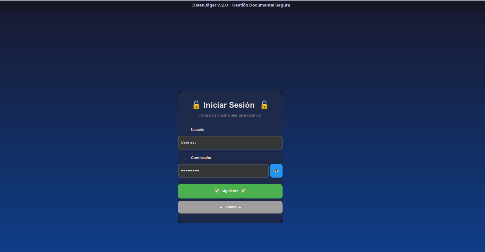

```
[Imagen: Pantalla de creacion de usuario con validacion de fortaleza de contrasena]
```
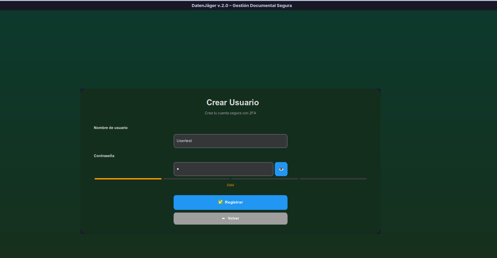

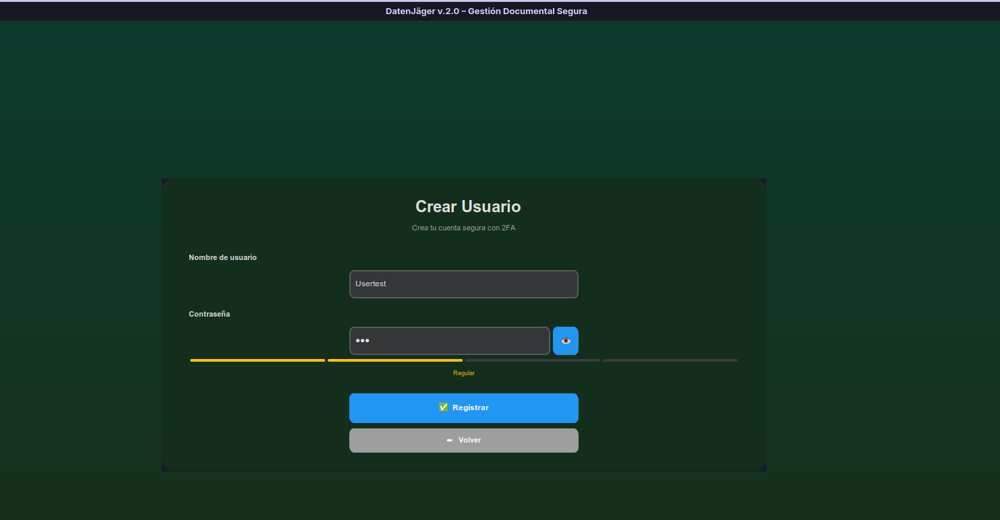

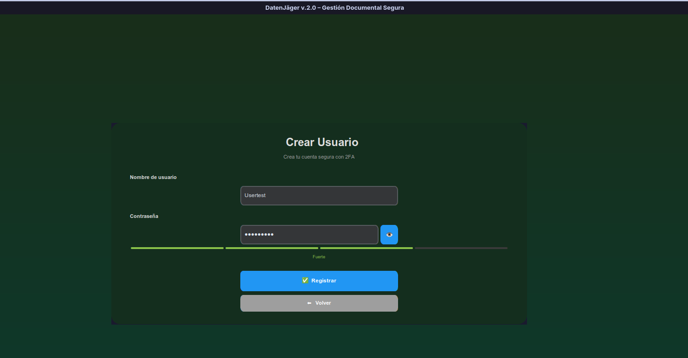

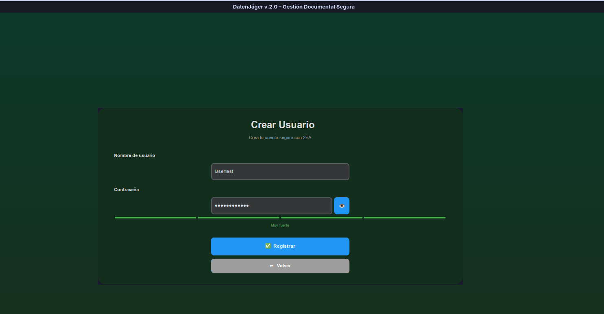

---

### Configuracion de Autenticacion de Dos Factores (2FA)

```
[Imagen: Configuracion del codigo QR para Google Authenticator]
```
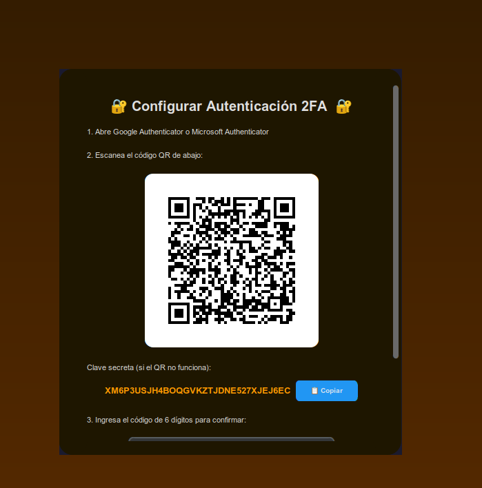

---

### Panel Principal -- Dashboard

```
[Imagen: Panel principal mostrando estadisticas (PDFs totales, espacio usado, personas)]
```
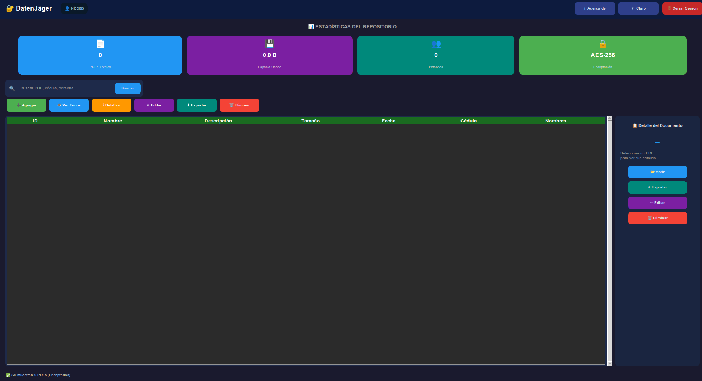

---

### Gestion de Documentos

```
[Imagen: Vista de lista de documentos con filtros y etiquetas]
```
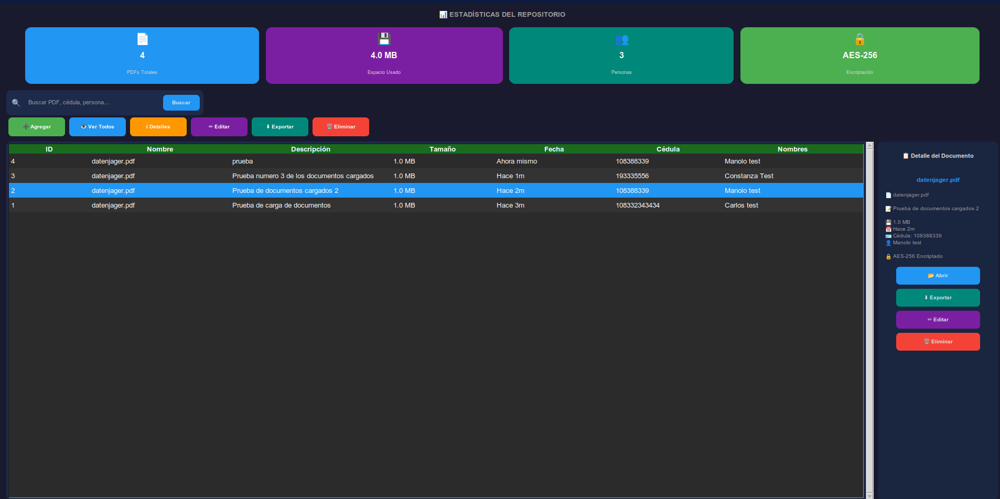

---

### Subida y Registro de Documentos

```
[Imagen: Formulario de subida de PDF con asociacion a persona y etiquetas]
```
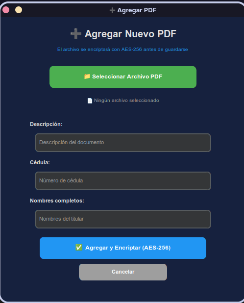

---

### Modo Oscuro / Modo Claro

```
[Imagenes: Comparativa del sistema en modo oscuro vs modo claro]
```

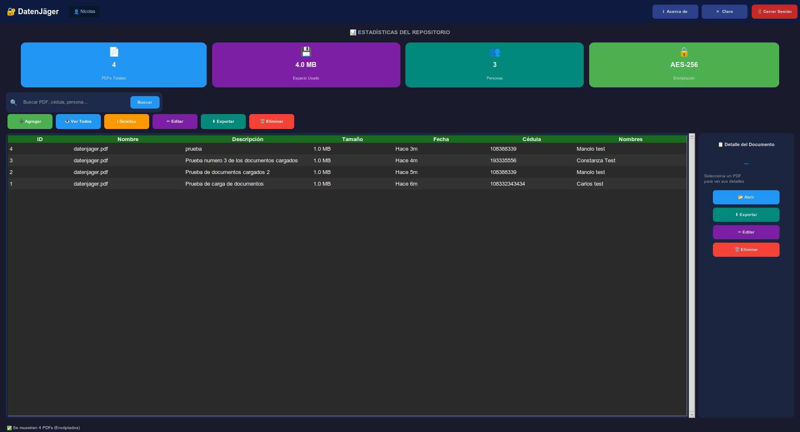

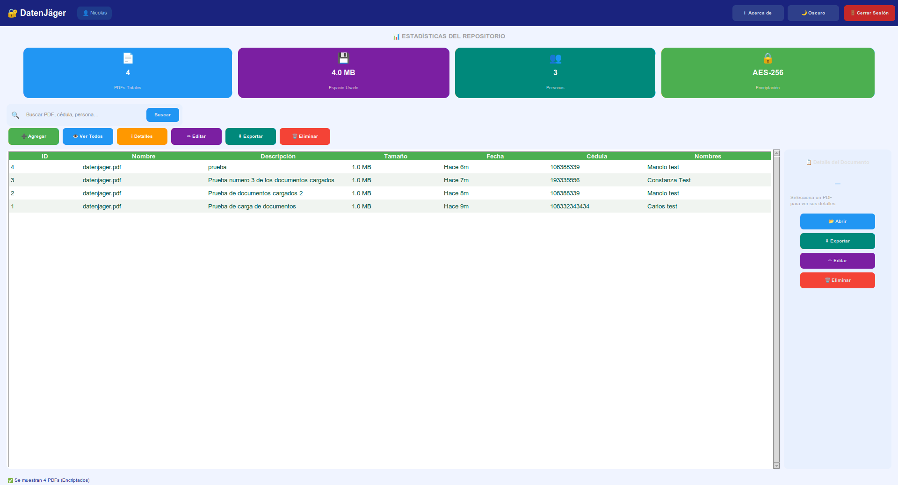

---

## Caracteristicas Principales

| Modulo | Funcionalidad |
|--------|--------------|
| **Autenticacion** | Login con usuario/contrasena + 2FA (TOTP compatible con Google Authenticator) + Reset de contrasena |
| **Seguridad** | Encriptacion AES-256-GCM (AEAD) de documentos con verificacion de autenticidad |
| **Contrasenas** | Hashing PBKDF2-HMAC-SHA256 con 260 000 iteraciones y salt aleatorio. Migracion automatica de legacy SHA-256 |
| **Proteccion** | Bloqueo de cuenta tras 5 intentos fallidos (15 min de espera). Timeout de sesion inactiva |
| **Documentos** | Subida, visualizacion integrada, descarga y eliminacion de archivos PDF con visor nativo |
| **Busqueda** | Busqueda en tiempo real (debounced 400ms) por nombre, descripcion y persona asociada |
| **Etiquetas** | Clasificacion de documentos con etiquetas personalizables y filtrado |
| **Personas** | Asociacion de documentos a personas identificadas por cedula con auto-refresh |
| **Dashboard** | Panel con estadisticas en tiempo real: total PDFs, espacio usado, personas registradas, timeline |
| **Auditoria** | Registro completo de acciones realizadas en el sistema con timestamps y usuario |
| **Temas** | Soporte de modo oscuro, claro y automatico con sincronizacion dinamica (refresh 1.4s) |
| **Atajos** | Atajos de teclado contextuales (`Ctrl+N`, `Ctrl+F`, `Ctrl+Q`, `F11`, `Delete`) |
| **Config** | Persistencia de configuracion de usuario (tema, tamano de ventana, maximizado, etc.) con integridad HMAC |
| **Reportes** | Generacion de reportes en CSV y PDF con estadisticas e inventario completo |

---

## Stack Tecnologico

### Lenguajes y Runtime

| Tecnologia | Version | Descripcion |
|-----------|---------|-------------|
| **Python** | 3.10+ | Lenguaje principal del proyecto |

### Frameworks y Librerias UI

| Tecnologia | Version | Descripcion |
|-----------|---------|-------------|
| **CustomTkinter** | Latest | Framework de interfaz grafica moderna basado en Tkinter |
| **Tkinter (ttk)** | Built-in | Widgets nativos (Treeview, Scrollbar, Menu, Style) |
| **Pillow (PIL)** | Latest | Procesamiento y carga de imagenes e iconos PNG |

### Base de Datos

| Tecnologia | Version | Descripcion |
|-----------|---------|-------------|
| **SQLite** | Built-in | Motor de base de datos relacional local (modo WAL) |

### Seguridad y Criptografia

| Tecnologia | Version | Descripcion |
|-----------|---------|-------------|
| **cryptography** | Latest | Encriptacion AES-256-GCM (AEAD), derivacion PBKDF2 de session key con 600k iteraciones |
| **pyotp** | Latest | Generacion y validacion de tokens TOTP para 2FA con soporte backup codes |
| **qrcode** | Latest | Generacion de codigos QR para configuracion 2FA e integracion Google Authenticator |
| **hashlib / hmac / secrets** | Built-in | Hashing PBKDF2 (260k iteraciones para auth, 600k para encriptacion), HMAC-SHA256 integridad config |

### Reportes y Documentos

| Tecnologia | Version | Descripcion |
|-----------|---------|-------------|
| **PyMuPDF (fitz)** | Latest | Renderizado de PDFs por paginas (visor inline con zoom y scroll) |

---

## Arquitectura del Proyecto

```
DatenJager/
|
|-- main.py              # Aplicacion principal  --  UI, auth, navegacion
|-- database.py          # Modulo de base de datos (SQLite, hashing, rate-limiting)
|-- encryption.py        # Modulo de encriptacion AES-256 (Fernet + PBKDF2)
|-- config.py            # Configuracion persistente del usuario (JSON)
|-- ui_components.py     # Componentes UI reutilizables (notificaciones, barras, dialogos)
|-- icons.py             # Sistema de iconos PNG (carga y cache de assets)
|-- reporter.py          # Generacion de reportes (CSV y PDF)
|
|-- pdf_manager.py       # Modulo de operaciones CRUD de PDFs
|-- personas.py          # Modulo de gestion de personas (CRUD titular)
|-- audit.py             # Modulo de auditoria (visor de logs y registro de eventos)
|
|-- assets/
|   |-- icons/           # Iconos PNG del sistema (44 iconos Lucide)
|
|-- docs/
|   |-- screenshots/     # Capturas de pantalla para documentacion
|
|-- base_datos_pdfs.db   # Base de datos SQLite (generada en tiempo de ejecucion)
|-- config.json          # Archivo de configuracion (generado en ejecucion)
|
|-- requirements.txt     # Dependencias del proyecto
|-- README.md            # Este archivo
```

---

## Features Avanzadas

Ademas de las caracteristicas principales, DatenJager incluye funcionalidades avanzadas para mejorar la experiencia de usuario y la seguridad:

| Feature | Descripcion |
|---------|-------------|
| **Trust Device** | Recuerda dispositivos de confianza durante 24-72 horas, evitando re-ingreso de TOTP en logins posteriores |
| **Backup Codes** | 10 codigos de recuperacion generados durante setup 2FA para acceso en emergencias |
| **Reset Contrasena Seguro** | Proceso de 3 pasos mediante verificacion 2FA o backup codes antes de cambiar contrasena |
| **PDF Viewer Integrado** | Visor nativo de PDFs con zoom, navegacion de paginas y descifrado automatico |
| **Vista Mosaico** | Visualizacion alternativa en grid de 4 columnas con vistas previas visuales de documentos |
| **Auto-refresh Personas** | Panel de personas se actualiza automaticamente cada 2 segundos para detectar cambios |
| **Debounced Search** | Busqueda optimizada con delay de 400ms para reducir carga BD durante tipeo rapido |
| **Derivacion Clave Robusta** | PBKDF2 con 600,000 iteraciones para derivacion de claves de encriptacion de documentos |
| **Migracion Hash Legacy** | Deteccion automatica y conversion de hashes SHA-256 antiguos a PBKDF2 en siguiente login exitoso |
| **Timeout Sesion** | Cierre automatico de sesion tras inactividad (configurable en config.json) |
| **Session Key Per User** | Cada usuario tiene su propia session key derivada de contrasena + salt, sin compartir |

---

## UI/UX y Animaciones

El sistema implementa una interfaz moderna y fluida con multiples capas de animacion y feedback visual:

### Animaciones Principales

| Animacion | Ubicacion | Descripcion |
|-----------|-----------|-------------|
| **Typewriter Animado** | Intro screen | Efecto de escritura progresiva con 6 frases rotativas |
| **Cosmic Background** | Intro + Auth screens | Gradiente animado con estrellas, cometas y particulas sparkle |
| **Fade Overlay Transition** | Transiciones pantallas | Desvanecimiento suave entre vistas principales |
| **Shake Effect** | Campos de error | Vibracion visual en inputs con datos invalidos |
| **TOTP Countdown Ring** | 2FA login screen | Anillo circular animado que progresa de verde a rojo en 30 segundos |
| **Progress Bar Animado** | Subida de PDFs | Barra de progreso con color que advierte e indicador de velocidad |
| **GradientBackground** | Componentes | Fondo con gradiente interpolado dinamicamente |
| **Hover Effects** | Botones + Cards | Estados visuales suaves en interaccion del usuario |

### UI Components Personalizados

- **Notification System**: Toasts apilables con colores semanticos (success/error/warning/info)
- **PasswordStrengthBar**: Barra visual de 4 colores indicando fortaleza de contrasena
- **DashboardWidget**: Paneles de estadisticas con graficos y timelines
- **ConfirmDialog**: Dialogos de confirmacion con callbacks
- **Context Menu**: Menu clic derecho en documentos con acciones rapidas

### Tema Dark/Light

- Sincronizacion dinamica cada 1.4 segundos
- Paleta de colores adaptada para legibilidad en ambos modos
- Intro screen siempre en tema oscuro (diseno fijo)
- TreeView con alternancia de colores para mejor contraste (even/odd rows)

---

## Descripcion de Modulos

### Modulos Core (infraestructura del sistema)

| Archivo | Tipo | Responsabilidad |
|---------|------|----------------|
| `main.py` | Core | Punto de entrada. Contiene la clase `AppDBPDF` con la UI principal: pantallas de intro, login, registro, dashboard, navegacion, 2FA, configuracion de cuenta y control de sesion |
| `database.py` | Core | Gestion de la base de datos SQLite: creacion de tablas, indices, hashing de contrasenas (PBKDF2), verificacion, rate-limiting y utilidades de formato |
| `config.py` | Core | Clase `Config` para lectura y escritura del archivo `config.json` con preferencias persistentes del usuario |

### Modulos de Seguridad

| Archivo | Tipo | Responsabilidad |
|---------|------|----------------|
| `encryption.py` | Seguridad | Clase `EncryptionManager` que gestiona la derivacion de claves y la encriptacion/desencriptacion AES-256 de los datos almacenados |

### Modulos de Logica de Negocio

| Archivo | Tipo | Responsabilidad |
|---------|------|----------------|
| `pdf_manager.py` | Logica | Clase `GestorPDF` con todas las operaciones CRUD de documentos: agregar, listar, buscar, ver detalles, abrir/descifrar, editar metadatos, eliminar y exportar |
| `personas.py` | Logica | Clase `GestorPersonas` con el CRUD de titulares de documentos: agregar, editar, eliminar personas, busqueda en tiempo real y auto-refresco |
| `audit.py` | Logica | Clase `GestorAuditoria` con el visor de log de auditoria (filtros por fecha y accion), visor de log backend y el metodo de registro de eventos |
| `reporter.py` | Logica | Clase `ReporteInventario` para generacion de reportes en formatos CSV y PDF con estadisticas del sistema |

### Modulos de Interfaz

| Archivo | Tipo | Responsabilidad |
|---------|------|----------------|
| `ui_components.py` | UI | Componentes visuales reutilizables: `Notification` (toasts apilables), `PasswordStrengthBar`, `GradientBackground` animado, `ProgressBarModerno`, `DashboardWidget`, `ConfirmDialog` y `PDFViewerWindow` |
| `icons.py` | UI | Sistema de carga y cache de iconos PNG desde `assets/icons/`. Provee la funcion `get_icon()` utilizada en toda la interfaz |

---

## Esquema de Base de Datos

```sql
Usuarios
|-- id               INTEGER PK AUTOINCREMENT
|-- nombre           TEXT UNIQUE NOT NULL
|-- contrasena       TEXT NOT NULL          -- Hash PBKDF2-HMAC-SHA256
|-- totp_secret      TEXT                   -- Secreto TOTP para 2FA
|-- totp_enabled     INTEGER DEFAULT 0
|-- backup_codes     TEXT                   -- Codigos de respaldo 2FA
|-- fecha_creacion   TEXT NOT NULL
|-- failed_attempts  INTEGER DEFAULT 0      -- Intentos fallidos de login
|-- locked_until     TEXT                   -- Bloqueo temporal de cuenta

Personas
|-- id               INTEGER PK AUTOINCREMENT
|-- cedula           TEXT UNIQUE NOT NULL
|-- nombres          TEXT NOT NULL

PDFs
|-- id               INTEGER PK AUTOINCREMENT
|-- nombre           TEXT NOT NULL
|-- descripcion      TEXT
|-- datos            BLOB NOT NULL          -- Contenido encriptado AES-256
|-- datos_encriptados INTEGER DEFAULT 1
|-- tamano           INTEGER NOT NULL
|-- fecha_subida     TEXT NOT NULL
|-- usuario_id       INTEGER FK -> Usuarios(id)
|-- persona_id       INTEGER FK -> Personas(id)

Etiquetas
|-- id               INTEGER PK AUTOINCREMENT
|-- nombre           TEXT UNIQUE NOT NULL

PDF_Etiquetas                               -- Tabla pivote N:M
|-- pdf_id           INTEGER FK -> PDFs(id)
|-- etiqueta_id      INTEGER FK -> Etiquetas(id)

Auditoria
|-- id               INTEGER PK AUTOINCREMENT
|-- accion           TEXT NOT NULL
|-- pdf_id           INTEGER
|-- usuario_id       INTEGER
|-- fecha            TEXT NOT NULL
```

---

## Seguridad

El sistema implementa multiples capas de seguridad:

### Autenticacion
- **Hashing de contrasenas:** PBKDF2-HMAC-SHA256 con **260 000 iteraciones** y salt aleatorio de 16 bytes. Formato almacenado: `pbkdf2:<salt_hex>:<hash_hex>`.
- **Compatibilidad retroactiva:** Soporta migracion automatica desde hashes SHA-256 legacy (sin salt) al nuevo formato PBKDF2 en el siguiente inicio de sesion exitoso.
- **Indicador de fortaleza:** Validacion visual de la contrasena durante el registro (Muy debil -> Muy fuerte).
- **Rate limiting:** Bloqueo de cuenta tras **5 intentos fallidos** durante **15 minutos**.

### 2FA (Autenticacion de Dos Factores)
- Basado en el estandar **TOTP (RFC 6238)**, compatible con **Google Authenticator** y otras apps TOTP.
- Configuracion mediante codigo QR generado con la clave secreta del usuario.
- **Codigos de respaldo** para recuperacion de cuenta.

### Encriptacion de Documentos
- Los PDFs se almacenan **encriptados** en la base de datos mediante **AES-256 (Fernet)**.
- La clave de encriptacion se deriva de la contrasena del usuario usando **PBKDF2-HMAC-SHA256** con **600 000 iteraciones** (numero de iteraciones mayor al del hashing de contrasenas ya que aqui se prioriza maxima resistencia a fuerza bruta sobre el tiempo de desbloqueo de sesion).
- Los documentos solo pueden ser desencriptados con la contrasena correcta del usuario.

### Base de Datos
- **WAL mode** (Write-Ahead Logging) para mayor concurrencia y rendimiento.
- Indices optimizados sobre columnas de busqueda frecuente.

---

## Requisitos Previos

- **Python 3.10** o superior
- **pip** (gestor de paquetes de Python)
- Sistema operativo: Windows, Linux o macOS

### Dependencias

```bash
pip install customtkinter cryptography pyotp qrcode Pillow PyMuPDF
```

O si dispones de un archivo `requirements.txt`:

```bash
pip install -r requirements.txt
```

---

## Instalacion y Ejecucion (DEV)

### 1. Clonar el repositorio

```bash
git clone https://github.com/RavenCore99/DatenJ-ger.git
cd DatenJ-ger
```

### 2. Crear un entorno virtual (recomendado)

```bash
# Crear entorno virtual
python -m venv venv

# Activar -- Windows
venv\Scripts\activate

# Activar -- Linux / macOS
source venv/bin/activate
```

### 3. Instalar dependencias

```bash
pip install customtkinter cryptography pyotp qrcode Pillow PyMuPDF
```

### 4. Ejecutar la aplicacion

```bash
python main.py
```

Al primer inicio, la base de datos `base_datos_pdfs.db` y el archivo de configuracion `config.json` se crearan automaticamente en el directorio del proyecto.

---

## Guia de Uso

### Primer Acceso

1. **Ejecuta** `python main.py` para iniciar el sistema.
2. En la pantalla de inicio, haz clic en **"Acceder al Sistema"** o pulsa en el titulo.
3. Como es la primera vez, selecciona la pestana **"Registrarse"**.
4. Ingresa un nombre de usuario y una contrasena segura (el indicador de fortaleza te guiara).
5. Opcionalmente, configura la **autenticacion de dos factores (2FA)** con Google Authenticator.

### Gestion de Documentos

| Accion | Como hacerlo |
|--------|-------------|
| **Subir PDF** | Boton "Agregar PDF" o `Ctrl+N` |
| **Buscar** | Campo de busqueda en tiempo real o `Ctrl+F` |
| **Ver/Descargar** | Seleccionar documento y hacer doble clic o boton "Abrir" |
| **Eliminar** | Seleccionar documento y boton "Eliminar" o tecla `Delete` |
| **Exportar** | Seleccionar documento y boton "Exportar" |

### Asociar Documentos a Personas

Al subir un documento es posible asignarlo a una persona registrada por cedula. Esto facilita la busqueda y organizacion de los documentos laborales por empleado.

### Atajos de Teclado

| Atajo | Accion |
|-------|--------|
| `Ctrl + N` | Agregar nuevo PDF |
| `Ctrl + F` | Enfocar campo de busqueda |
| `Ctrl + Q` | Cerrar la aplicacion |
| `F11` | Pantalla completa / Maximizar |
| `Delete` | Eliminar documento seleccionado |

---

## Configuracion

El archivo `config.json` se genera automaticamente y almacena las preferencias del usuario:

```json
{
    "theme": "System",
    "fullscreen": false,
    "window_size": "1100x760",
    "encryption_enabled": true,
    "2fa_enabled": true
}
```

| Clave | Valores posibles | Descripcion |
|-------|-----------------|-------------|
| `theme` | `"Dark"`, `"Light"`, `"System"` | Tema visual de la interfaz |
| `fullscreen` | `true` / `false` | Estado de pantalla completa |
| `window_size` | `"1100x760"` | Tamano de la ventana en pixeles |
| `encryption_enabled` | `true` / `false` | Habilita encriptacion AES-256 de PDFs |
| `2fa_enabled` | `true` / `false` | Habilita el modulo de 2FA |

El tema puede cambiarse desde la interfaz del sistema sin necesidad de editar el archivo manualmente.

---

## Issues Conocidos

Los siguientes issues fueron identificados durante el desarrollo y estan planeados para futuras versiones:

### Prioridad Alta

- `PasswordStrengthBar.set_strength()`: Metodo invocado en reset flow pero no implementado. Se llama sin args en linea 1245 de main.py
- `colors['warning']` inconsistente: Algunas referencias usan `colors['warning']` y otras `colors['secondary']` sin definicion clara

### Prioridad Media

- Edicion de descripcion PDF limitada: Solo se puede editar mediante modal, no inline en lista
- Filtro por rango de fechas: Feature planeada pero no implementada en busqueda
- Exportar listado de etiquetas: Mencionado en pdf_manager pero no completo

### Mejoras Planificadas

- Completar docstrings en modulos personas.py, pdf_manager.py, audit.py y reporter.py
- Agregar try/except defensivo en inicializacion de PasswordStrengthBar
- Cache local de preferencias de usuario (tema) en memoria para reducir I/O config.json
- Importacion batch de multiples PDFs simultaneamente
- Vista de estadisticas por etiqueta y rango temporal

---

## Referencias

- International Council on Archives (2016). *Principles and Functional Requirements for Records in Electronic Office Environments.*
- Davenport, T. H. & Prusak, L. (1998). *Working Knowledge: How Organizations Manage What They Know.* Harvard Business School Press.
- UNESCO (2015). *UNESCO Recommendation concerning the Preservation of, and Access to, Documentary Heritage.*
- Python Software Foundation. [https://www.python.org](https://www.python.org)
- CustomTkinter. [https://github.com/TomSchimansky/CustomTkinter](https://github.com/TomSchimansky/CustomTkinter)
- cryptography.io -- AES-256-GCM. [https://cryptography.io](https://cryptography.io)
- RFC 6238 -- TOTP: Time-Based One-Time Password Algorithm. [https://tools.ietf.org/html/rfc6238](https://tools.ietf.org/html/rfc6238)
- OWASP -- Authentication Cheat Sheet. [https://cheatsheetseries.owasp.org/](https://cheatsheetseries.owasp.org/)
- NIST SP 800-132 -- Password-Based Key Derivation. [https://nvlpubs.nist.gov/](https://nvlpubs.nist.gov/)

---

<div align="center">

**DatenJager v.2.1** -- Gestion Documental Empresarial

*"La informacion es poder; protegerla es responsabilidad."*

Estado: Produccion-Listo | Completitud: 98% | Seguridad: Estandar Alto

</div>
